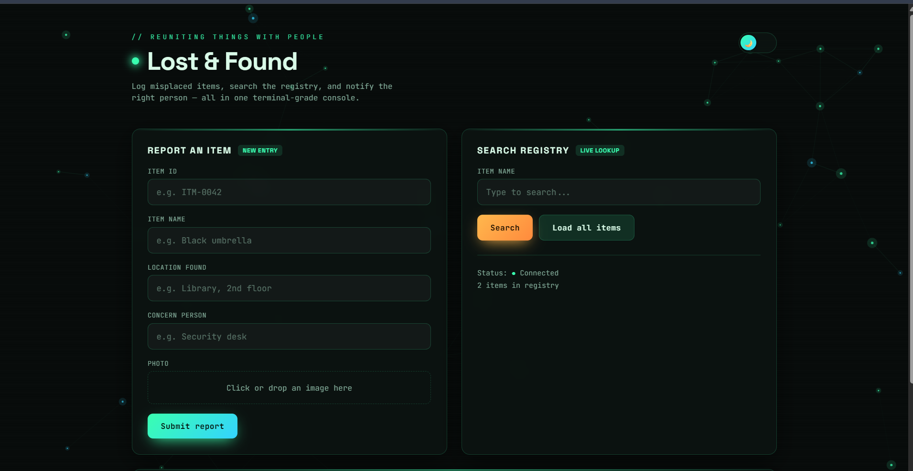
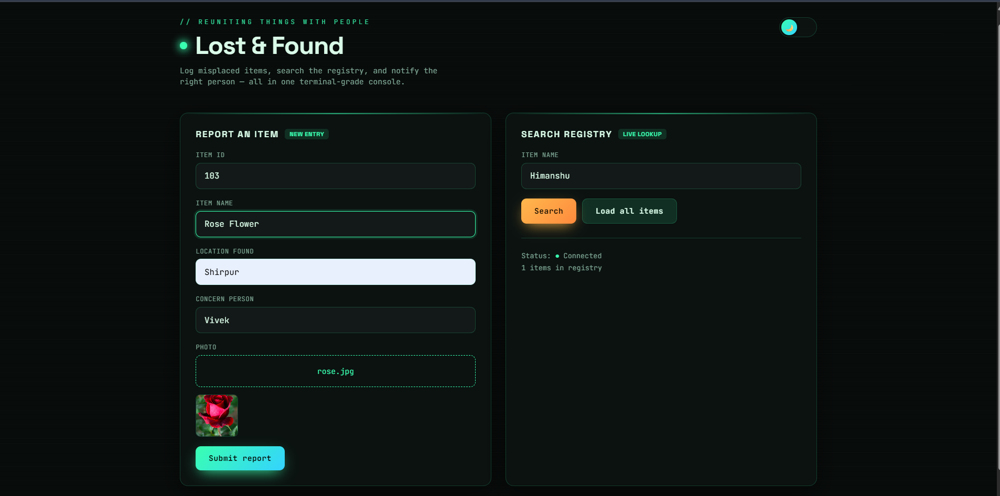
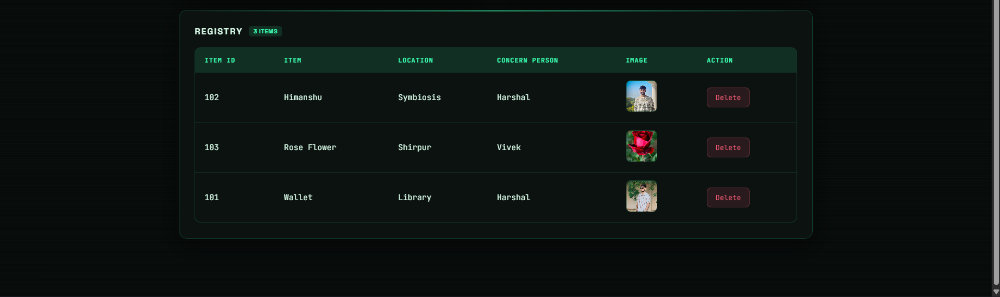
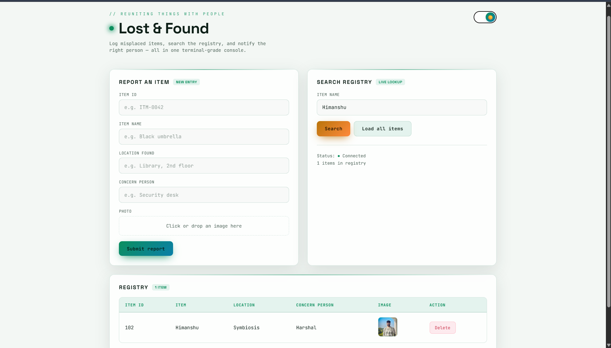

# 🔍 Lost & Found Management System

<p align="center">
  
</p>

<p align="center">


</p>

---

# 📖 Overview

The **Lost & Found Management System** is a fully **serverless cloud application** developed using **Amazon Web Services (AWS)**. The application enables users to report lost or found items by uploading an image along with item details through a web interface.

The backend is powered by **AWS Lambda**, while **Amazon API Gateway** exposes REST APIs for communication. Uploaded images are stored in **Amazon S3**, and item metadata is securely stored in **Amazon DynamoDB**.

To efficiently process file uploads, the project uses a **Lambda Layer** to parse **multipart/form-data**, allowing users to upload images directly without converting them to Base64.

---

# 🚀 Features

- 📤 Upload lost or found items with images
- 📷 Direct image upload using **multipart/form-data**
- 📦 Image parsing using **AWS Lambda Layer**
- ☁️ Store uploaded images in Amazon S3
- ⚡ Serverless backend using AWS Lambda
- 🌐 REST APIs using Amazon API Gateway
- 💾 Store item details in Amazon DynamoDB
- 🔍 Retrieve all reported items
- 🚀 Fully serverless and highly scalable
- 🔐 Secure AWS IAM integration

---

# ☁️ AWS Services Used

| AWS Service | Purpose |
|-------------|---------|
| Amazon S3 | Stores uploaded item images |
| AWS Lambda | Executes backend business logic |
| Lambda Layer | Parses multipart image uploads |
| API Gateway | Exposes REST APIs |
| DynamoDB | Stores lost & found item metadata |
| IAM | Provides secure permissions |
| CloudWatch | Logs and monitoring |

---

# 🛠️ Tech Stack

- HTML5
- CSS3
- JavaScript
- Python
- Amazon S3
- AWS Lambda
- Lambda Layers
- Amazon API Gateway
- Amazon DynamoDB
- AWS IAM
- CloudWatch

---

# 🏗️ Architecture

```text
                     +--------------------+
                     |       User         |
                     +---------+----------+
                               |
                               |
                  multipart/form-data Request
                               |
                               ▼
                    Amazon API Gateway
                               |
                               ▼
                    AWS Lambda Function
                     (Lambda Layer Parses Image)
                               |
               +---------------+---------------+
               |                               |
               ▼                               ▼
        Amazon S3 Bucket               Amazon DynamoDB
     (Store Uploaded Image)        (Store Item Metadata)
```

---

# 🔌 REST API

## 📤 Report Lost/Found Item

**Endpoint**

```http
POST /report
```

**Content-Type**

```
multipart/form-data
```

### Form Parameters

| Parameter | Type | Required | Description |
|-----------|------|----------|-------------|
| image | File | ✅ | Item Image |
| name | Text | ✅ | Item Name |
| description | Text | ✅ | Item Description |
| status | Text | ✅ | Lost or Found |

---

## 📥 Get All Items

```http
GET /items
```

Returns all reported items stored in DynamoDB.

---

# ⚙️ Project Workflow

### Step 1

User selects an image and enters item details.

⬇️

### Step 2

Frontend sends a **multipart/form-data** request to **Amazon API Gateway**.

⬇️

### Step 3

API Gateway invokes the **AWS Lambda Function**.

⬇️

### Step 4

The **Lambda Layer** extracts the uploaded image from the request.

⬇️

### Step 5

The image is uploaded to **Amazon S3**.

⬇️

### Step 6

The image URL and metadata are stored in **Amazon DynamoDB**.

⬇️

### Step 7

Users retrieve all items using the GET API.

---

# 📸 Screenshots

## 🏠 Home Page


---

## 📤 Upload Lost Item



---

## 📋 View All Items



---

## ☁️ Light Mode



---


# 📂 Project Structure

```text
LOSTANDFOUND/
│
├── screenshots/
│   ├── home.png
│   ├── upload.png
│   ├── items.png
│   ├── architecture.png
|
├── index.html
├── lambda_function.py
└── README.md
```

---

# 🚀 Deployment

### 1. Create an Amazon S3 Bucket

Store uploaded item images.

---

### 2. Create a DynamoDB Table

Store metadata for lost and found items.

---

### 3. Create an AWS Lambda Function

Deploy the backend code.

---

### 4. Add a Lambda Layer

Enable multipart/form-data parsing for image uploads.

---

### 5. Configure IAM Role

Grant Lambda access to:

- Amazon S3
- DynamoDB
- CloudWatch

---

### 6. Create REST APIs

Configure:

- POST `/report`
- GET `/items`

using Amazon API Gateway.

---

### 7. Enable CORS

Allow frontend access from browsers.

---

### 8. Deploy the Frontend

Host the frontend on:

- Amazon S3 Static Website Hosting
- Apache
- Nginx
- EC2

---

# 🔒 Security

- IAM Role-Based Access Control
- Least Privilege Principle
- Secure S3 Bucket Permissions
- API Gateway Request Validation
- CloudWatch Monitoring

---

# 📈 Scalability

The application leverages AWS Serverless services to provide:

- Automatic Scaling
- High Availability
- No Server Management
- Cost-Effective Deployment
- Event-Driven Architecture

---

# 💡 Key Learning Outcomes

- Serverless Application Development
- AWS Lambda Programming
- REST API Development
- Multipart File Upload Handling
- Lambda Layers
- Amazon S3 Integration
- Amazon DynamoDB Integration
- API Gateway Configuration
- IAM Permission Management
- Cloud Deployment Best Practices

---

# 🔮 Future Enhancements

- 🔑 User Authentication (Amazon Cognito)
- 📧 Email Notifications using Amazon SNS
- 🤖 Image Recognition using Amazon Rekognition
- 📍 GPS-Based Item Location
- 💬 Chat Between Finder & Owner
- 🔎 Search and Filter Items
- 📂 Category-Based Classification
- 📱 Mobile Responsive UI
- 🌍 Multi-Language Support

---

# 💻 Run Locally

Clone the repository:

```bash
git clone https://github.com/harshal0701-art/LostAndFound.git
```

Navigate to the project:

```bash
cd LostAndFound
```

Open the frontend:

```text
index.html
```

Deploy the Lambda function and configure the AWS resources to enable backend functionality.

---

# 👨‍💻 Author

## Harshal Chaudhari

**Computer Engineer**

Backend Developer | AWS Cloud Enthusiast

### Connect with Me

- GitHub: https://github.com/harshal0701-art
- LinkedIn: https://linkedin.com/in/your-profile

---

# ⭐ Support

If you found this project helpful:

⭐ Star this repository

🍴 Fork this repository

📢 Share it with others

---

# 📄 License

This project is licensed under the MIT License.

---

<p align="center">
Made with ❤️ by Harshal Chaudhari
</p>
